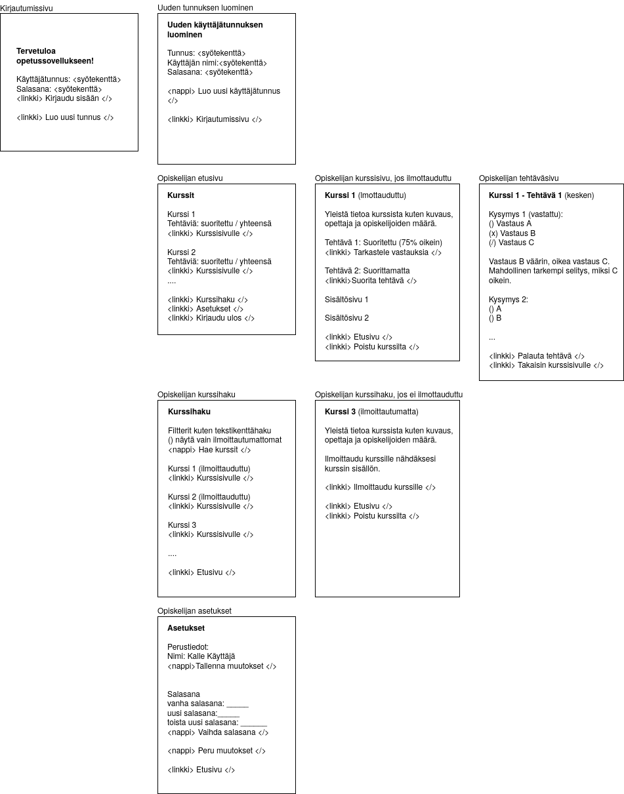

# Opetussovellus
<a name="ylos"></a>

Opetussovelluksen tarkoituksena on tarjota selainpohjainen alusta opetuksen tueksi sekä opettajille että oppilaille. Sovelluksen avulla opettajat voivat luoda oppilaille suoritettavaksi erilaisia kurssikohtaisia tehtäviä ja seurata näiden suorittamisen edistymistä. Lisäksi sovellukseen voi lisätä tehtävien lisäksi myös tekstipohjaista sisältöä. Sovellus tarjoaa yksilöllisen näkymän kullekin käyttäjälle ja omat käyttäjäroolit opettajille ja oppilaille. Käyttäjä tunnistetaan henkilökohtaisen käyttäjätunnuksen avulla. Näitä ylläpidetään ylläpitoroolin avulla.

Sovellus toteutetaan Helsingin yliopiston tietojenkäsittelytieteen aineopintojen tietokantasovellus-harjoitustyönä (tunnetaan myös _tsoha_). Lisätietoja löytyy kurssin [omilta sivulta](https://hy-tsoha.github.io/materiaali/index).

Sovelluksen aiheen pohjana toimii kurssimateriaalin ehdotus opetussovelluksen [sisällöstä](https://hy-tsoha.github.io/materiaali/pages/aiheen_valinta.html)

## Sisältö

- [Vaatimukset](#vaatimukset)

   - [Käyttöliittymä](#ui)
   - [Yhteenveto](#yhteenveto)
- [Arkkitehtuuri](#arkkitehtuuri)
- [Toteutus tällä hetkellä](#toteutus)
- [Kirjautuminen Herokuun](#kirjautuminen)


## <a name="vaatimukset"></a>Vaatimukset

Sovelluksessa on tuki kolmelle käyttäjäroolille:

1. Opiskelija
2. Opettaja
3. Ylläpitäjä

Kullekin käyttäjälle on oma henkilökohtaisella tunnuksella tunnistettava käyttäjätili johon kirjaudutaan sovelluksen aloitussivulta. Tunnus on siten aina yksilöllinen eikä useammalla käyttäjällä voi olla saman nimistä tunnusta. Tunnus on vähintään viiden merkin mittainen. Käyttäjät voivat luoda itse opiskelija-tason tunnunnuksen. Muita tunnuksia voi hallinnoida vain ylläpitäjä-roolin omaava käyttäjä, mutta kukin käyttäjä roolista riippumatta voi muuttaa omaa salasanaansa ja mahdollisia muita henkilökohtaisia tietojaan. Sovelluksessa on aina valmiina ylläpitotunnus, jota ei voi poistaa.

Sovellukseen voi luoda kursseja, joilla on yksilöllinen tunnus, kurssin nimi ja kuvaus. Kunkin kurssin alle voi:
 - luoda teksti- ja kuvapohjaista sisältöä
 - automaattisesti tarkastettavia tehtäviä

Opettajat ja ylläpitäjät voivat luoda ja tarkastella kursseja. Kurssien poistaminen tapahtuu joko kurssin luoneen opettajan tai kenen tahansa ylläpitäjän toimesta. Opettajat voivat tuottaa ja muokata kurssien sisältöä.

Opiskelijat voivat liittyä itse haluamilleen kursseille. Opettajat ja ylläpitäjät voivat nähdä, ketä kursseille on liittynyt.

Ilmoittauduttuaan kurssille opiskelijat voivat nähdä valitun kurssin sisällön ja suorittaa tämän alle luotuja tehtäviä. Opettajat voivat nähdä tehtävien suorituksiin liittyviä tietoja. Opiskelijat näkevät vain omat tietonsa.

### <a name="ui"></a>Käyttöliittymä

Sovelluksen käyttöliittymä on selainpohjainen ja sen tulee toimia yleisimmillä selaimilla (Chrome ja Firefox) sekä tekstipohjaisella selaimella.

Alla käyttöliittymäluonnos opiskelijakäyttäjän näkökulmasta.



###  <a name="yhteenveto"></a>Yhteenveto

Yhteenvetona alla taulu toiminnoista ja oikeuksista.

| Toiminto					| Opiskelija	| Opettaja	| Ylläpitäjä 	|
| :--------					| :------:	| :-----:		| :----:		|
| **Käyttäjähallinta** |
| Uuden käyttäjätunnuksen luonti (Opiskelija) 	| X 		| X		| X		|
| Käyttäjän muuttaminen opettajaksi 		| 		| 		| X		|
| Käyttäjän muuttaminen ylläpitäjäksi		| 		|		| X		|
| Omien käyttäjätietojen muuttaminen 		| X		| X		| X		|
| Toisten käyttäjätietojen muuttaminen		| 		|		| X		|
| **Sisältö**	 				| 		|		| 		|
| Kurssien luominen 				| 		| X		| X		|
| Oman kurssin poistaminen			| 		| X		| X		|
| Toisen luoman kurssin poistaminen		| 		| 		| X		|
| Oman kurssin sisällön muokkaaminen		| 		| X		| X		|
| Toisen kurssin sisällön muokkaaminen		| 		| X<sup>[1](#a1)</sup>	| X		|
| Kurssien kuvauksen tarkasteleminen		| X		| X		| X		|
| Kursseille ilmoittautuminen			| X		| 	X	| X		|
| Kurssien materiaalien tarkastelminen / suorittaminen	| X <sup>[2](#a2)</sup> | X	| X		|
| Kurssien materiaalien muokkaaminen 		| 		| X		| X 		|
| Omien suoritusten tarkasteleminen 		| X		| X		| X		|
| Toisten suoritusten tarkasteleminen 		| X 		| X		| X		|

<a name="a1">1</a>: Toistaiseksi opettajat voivat muokata myös toistensa kursseja, mutta jatkokehitysideana opettajien oikeuksia voisi rajoittaa tai luoda edistyneemmät opettaja-tunnukset - tai mahdollisuuden jakaa oikeuksia muille opettajille kurssikohtaisesti.

<a name="a2">2</a>: Opiskelijan ilmoittauduttua kurssille.


## <a name="arkkitehtuuri"></a>Arkkitehtuuri

Sovelluksen toiminnallisuus toteutetaan Python 3-kielellä Flask-moduulia hyödyntäen, jonka avulla renderöidään käyttöliittymänä toimivat HTML-sivut. Sivuilla käytetään myös JavaScriptiä loppukäyttäjkäyttökokemusta parantavien toimintojen toteuttamiseksi.

Sovelluksessa käytettävien tietojen pysyväistallennuseen käytetään PostgreSQL-tietokantaa.

### <a name="dbrakenne"></a>Tietokannan rakenne

Tietokannassa on käytössä seuraavat taulut:
- Users (käyttäjät)
- Courses (kurssit)
- Participants (osallistujat)

Myöhemmin sovellukseen tarvitaan alustavasti ainakin vielä seuraavia tauluja:
- Exercises (tehtävät)
- Choises (vastausvaihtoehdot)
- Answers (vastaukset)
- Textpages (tekstisivut)

ja mahdollisesti muita tauluja sovelluksen toteutuksen tarkentuessa.

Tietakannan SQL-skeema on tällä hetkellä seuraava:

```
CREATE TABLE users (
    id SERIAL PRIMARY KEY,
    username TEXT UNIQUE,
    password TEXT,
    first_name TEXT,
    last_name TEXT
);

CREATE TABLE courses (
    id SERIAL PRIMARY KEY,
    name TEXT UNIQUE,
    description TEXT,
    teacher_id INTEGER REFERENCES users (id)
);

CREATE TABLE participants (
    course_id INTEGER REFERENCES courses (id),
    user_id INTEGER REFERENCES users (id)
);
```

## <a name="toteutus"></a>Toteutus tällä hetkellä

Tällä hetkellä tietokannan toiminnallisuuksista on toteutettu seuraavaa:

Ennen kirjautumista käyttäjäjä voi:
- Tarkastella etusivua
- Kirjautua sisään tunnuksella ja salasanalla
- Luoda uuden tunnuksen

Kirjauduttuaan käyttäjä voi:
- Tarkastella etusivua
- Hakea kursseja
- Tarkastella kurssien sivuja
- Ilmoittautua kursseille
- Luoda uuden kurssin

Huomaa, että toistaiseksi sovelluksessa ei ole tukea eri käyttäjärooleille ja käyttöoikeuksien hallinnalle. Sen sijaan jokainen käyttäjä on samanarvoinen ja voi täten luoda uuden kurssin. Myöhemmin tämän on tarkoitus olla vain opettajiksi tai ylläpitäjiksi luokiteltujen käyttäjien ominaisuus.

Toistaiseksi ohjelman keskeisistä toiminnoista puuttuu myös tuki kurssikohtaisten tehtävien ja tekstisivujen luomista ja lukemista/suorittamista ja näihin liittyvien tilastojen tarkastelua varten.

## <a name="kirjautuminen"></a>Kirjautuminen Herokuun

Sovellukseen pääsee Herokussa osoitteessa: https://tso-harjoitustyo.herokuapp.com/ .

Voit luoda itsellesi omat testitunnukset/-tunnuksia sovelluksen sivulta https://tso-harjoitustyo.herokuapp.com/register.

[Palaa ylös](#ylos)